# Deploy arktos with mizar cni test
### The preferred OS is Ubuntu 18.04.

If you are using AWS, the recommended instance size is t2.2xlarge and the storage size is 128GB or more.

## Steps:   
### 1. Check the kernel version:
### Command:
```bash 
uname -a
```
### Output:
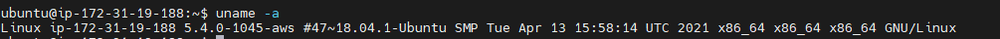

#### Update the kernel if the kernel version is below 5.6.0-rc2
### Command:
```bash
wget https://raw.githubusercontent.com/CentaurusInfra/mizar/dev-next/kernelupdate.sh

sudo bash kernelupdate.sh
```

### Output:
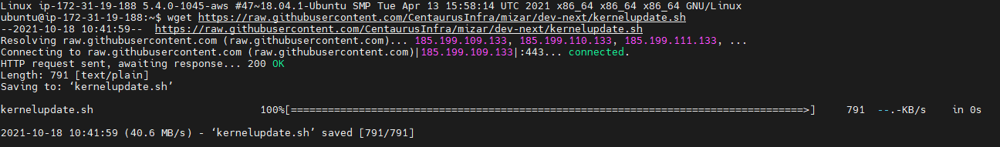

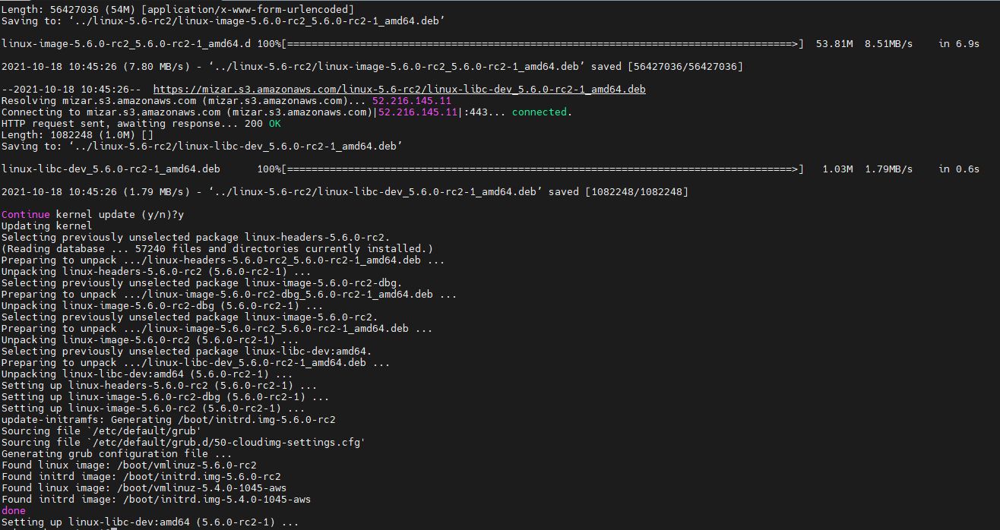

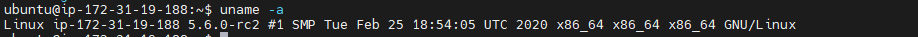

### 2. Clone the Arktos repository and install the required dependencies:
### Command: 
``` bash
git clone https://github.com/Click2Cloud-Centaurus/arktos.git ~/go/src/k8s.io/arktos

cd ~/go/src/k8s.io/arktos

git checkout cni-mizar

sudo bash ./hack/setup-dev-node.sh
```
### Output: 
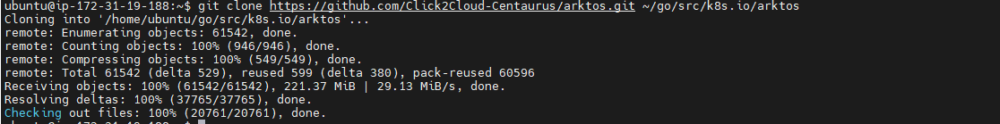

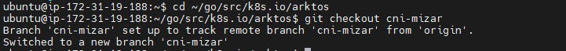

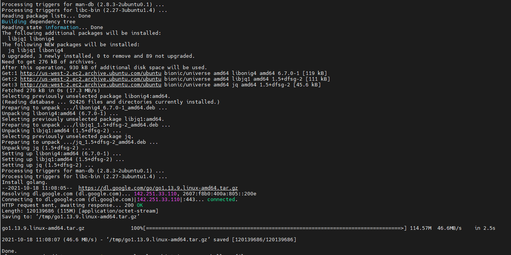

### Command:
```bash
echo export PATH=$PATH:/usr/local/go/bin\ >> ~/.profile

echo cd \$HOME/go/src/k8s.io/arktos >> ~/.profile

source ~/.profile
```

### Output:
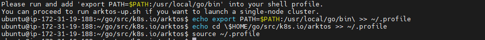

### 3. Start Arktos cluster
### Command: 
```bash
CNIPLUGIN=mizar ./hack/arktos-up.sh
```
### Output:
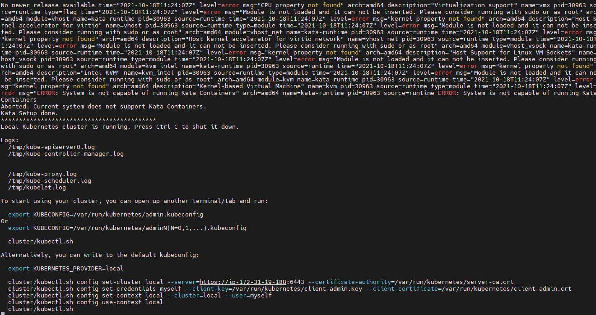

### 4. Verify mizar pods i.e. mizar-operator and mizar-daemon pods are in running state, for that run:

### Command:
```bash
./cluster/kubectl.sh get pods
```
### Output:
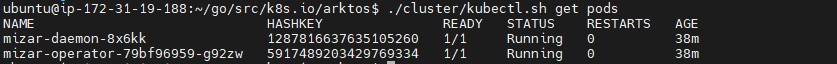

### deploy test pod 
### Command
```bash
 kubectl apply -f https://raw.githubusercontent.com/Click2Cloud-Centaurus/Documentation/main/test-yamls/test_pods.yaml
```
### Output:
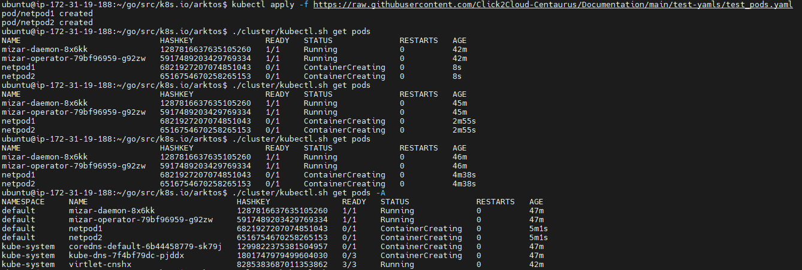

### Comment:
Pods stuck in creating container state

### get VPCs
### Command 
```bash
./cluster/kubectl.sh get vpc -A
```
### Output:
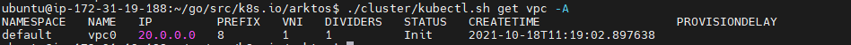

### get subnet
### command
```bash
./cluster/kubectl.sh get subnet -A
```
### Output:
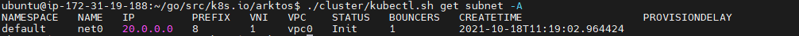


