# Setup a multi-node Arktos cluster using Ubuntu or custom image on GCE
 #### This document outlines the steps to deploy arktos cluster on GCE from remote workstation machine. 
 User will need to run following steps on workstation machine(the recommended instance size should be atleast 16 CPU and 32GB RAM and the storage size should be 150GB or more)

 ### Prerequisites
 User will need a GCP account, and gcloud configured in your bash profile. Please refer to gcloud configuration documentation or you can use following steps to install and configure gcloud utility.

 ### Step 1:
 ### Install gcloud
 #### Command
```bash
 echo "deb [signed-by=/usr/share/keyrings/cloud.google.gpg] https://packages.cloud.google.com/apt cloud-sdk main" | sudo tee -a /etc/apt/sources.list.d/google-cloud-sdk.list
 ```
 #### Output

 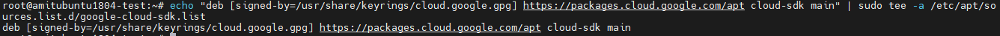

#### Command
```bash
sudo apt-get install apt-transport-https ca-certificates gnupg -y -q
```
#### Output

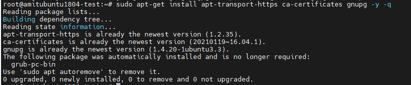

#### Command
```bash
curl https://packages.cloud.google.com/apt/doc/apt-key.gpg | sudo apt-key --keyring /usr/share/keyrings/cloud.google.gpg add -
```
#### Output

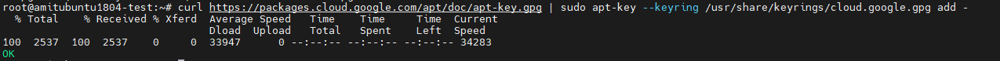

#### Command
```bash
sudo apt-get update -y && sudo apt-get install make google-cloud-sdk -y
```
#### Output

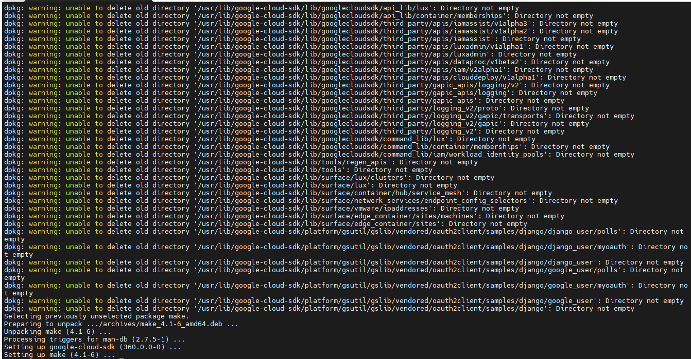

#### Command
```bash
gcloud init
```
#### Output

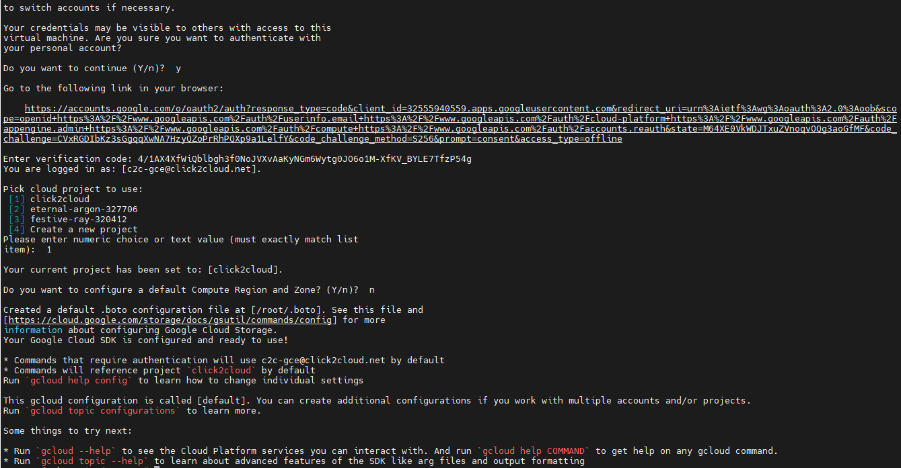


#### User will need docker and golang to create binaries and docker images.

### Install Docker

#### Command
```bash
curl -fsSL https://download.docker.com/linux/ubuntu/gpg | sudo gpg --dearmor -o /usr/share/keyrings/docker-archive-keyring.gpg
echo \
  "deb [arch=amd64 signed-by=/usr/share/keyrings/docker-archive-keyring.gpg] https://download.docker.com/linux/ubuntu \
  $(lsb_release -cs) stable" | sudo tee /etc/apt/sources.list.d/docker.list > /dev/null
  ```
  #### Output
  
  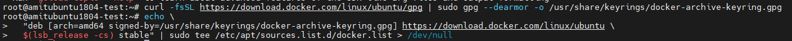
  
  #### Command
  ```bash
  sudo apt-get update -y
  ```
  
  #### Output
  
  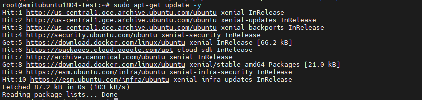
  
  #### Command
  ```bash
  sudo apt-get install docker-ce docker-ce-cli containerd.io -y
  ```
  #### Output
  
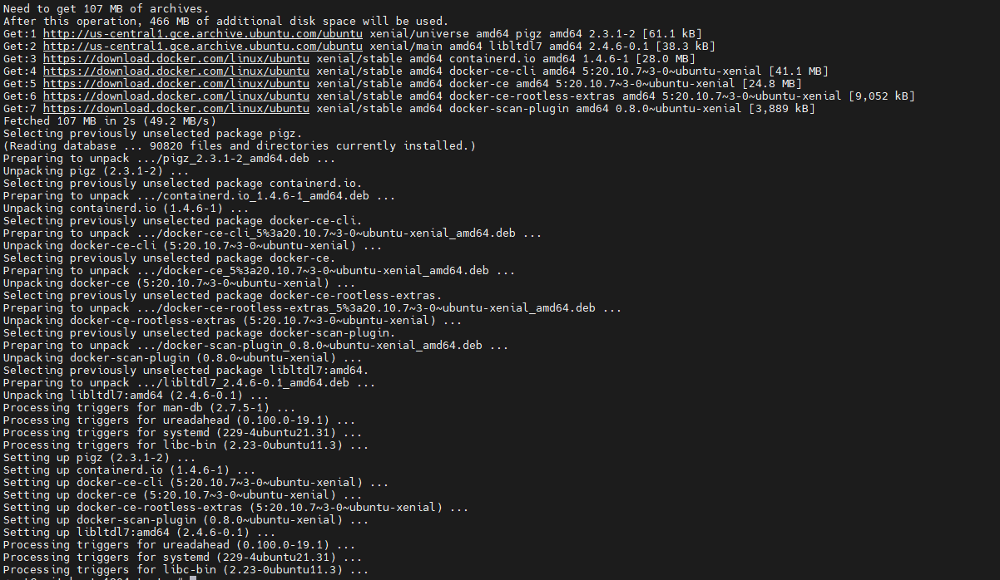


### Install Golang
#### Command
```bash
wget https://storage.googleapis.com/golang/go1.15.4.linux-amd64.tar.gz
```
#### Output

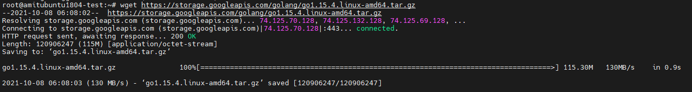

#### Command
```bash
sudo tar -C /usr/local -xzf go1.15.4.linux-amd64.tar.gz
```
#### Output

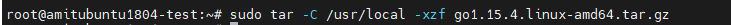

#### Command
```bash
sudo echo 'export PATH=$PATH:/usr/local/go/bin' >> $HOME/.profile
```
#### Output

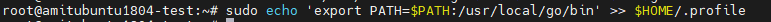

#### Command
```bash
sudo echo 'export GOPATH=$HOME/gopath' >> $HOME/.profile
```
#### Output

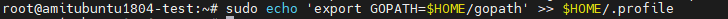

#### Command
```bash
source $HOME/.profile
```
#### Output

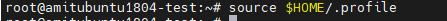


## Deploy Arktos cluster
### Clone arktos repository
#### Command
```bash
mkdir -p $HOME/go/src/k8s.io
cd $HOME/go/src/k8s.io
git clone -b  ubuntu-image-fix https://github.com/Click2Cloud-Centaurus/arktos.git
```
#### Output

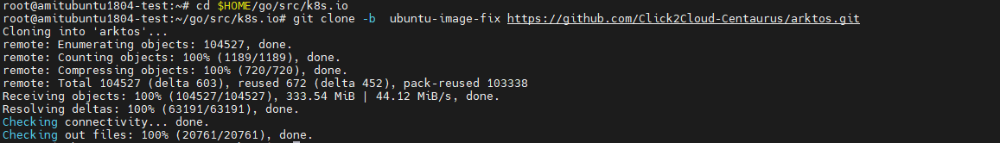

### Build the Arktos release binaries from a bash terminal from your Arktos source root directory
#### Command
```bash
cd $HOME/go/src/k8s.io/arktos
sudo make clean
sudo make quick-release
```
#### Output

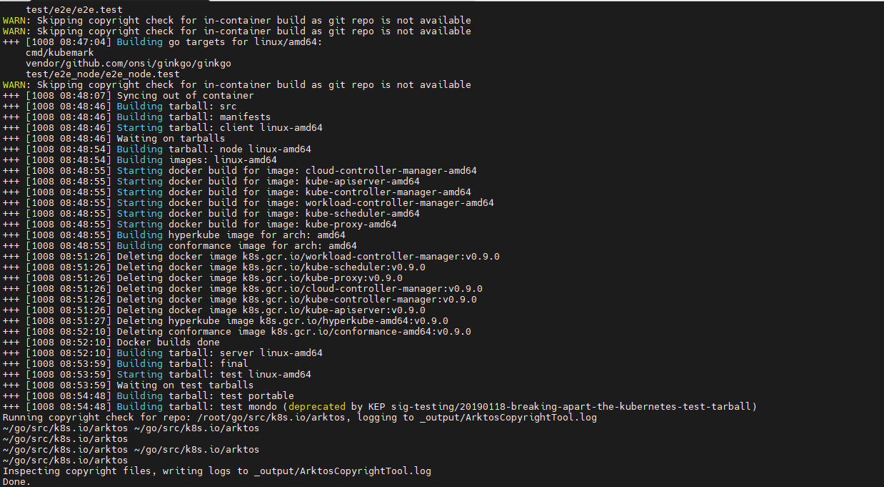


### Modify cluster/gce/config-default.sh to change configurations
#### To use ubuntu image user will need to change following parameters:
* KUBE_GCI_VERSION : provide image name (image-1)
* KUBE_GCE_MASTER_PROJECT: provide project name(click2cloud)
* KUBE_GCE_NODE_PROJECT: provide project name(click2cloud)
### After setting above parameters, deploy the arktos cluster on GCE, run kube-up script as follows:
#### Command
```bash
sudo ./cluster/kube-up.sh
```
#### Output

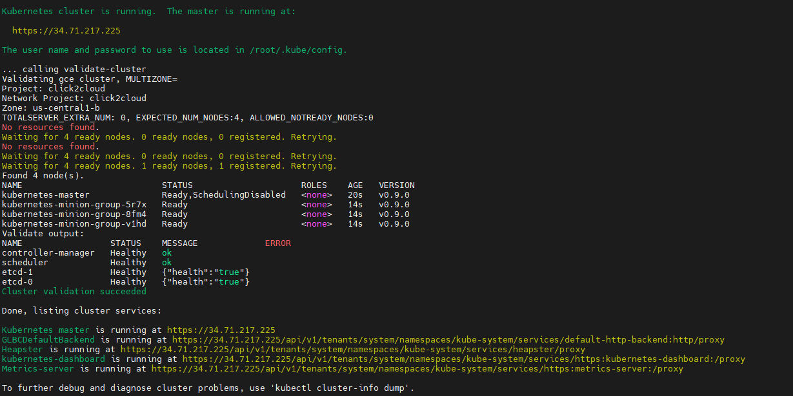

### Testing criteria from link: https://docs.projectcalico.org/security/tutorials/kubernetes-policy-basic

### * Configure namespaces
#### Let’s create the Namespace object from this guide.

#### Command
```bash
./cluster/kubectl.sh create ns policy-demo
```
#### Output
 
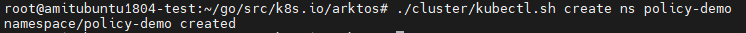
 

### * Create demo pods

#### 1. Create some nginx pods in the policy-demo namespace.

#### Command
```bash
./cluster/kubectl.sh create deployment --namespace=policy-demo nginx --image=nginx 
```
#### Output
 
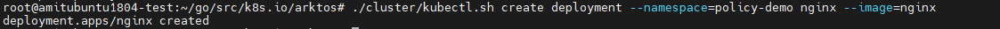
 
#### 2. Expose them through a service.
#### Command
```bash
./cluster/kubectl.sh expose --namespace=policy-demo deployment nginx --port=80
```
#### Output
 
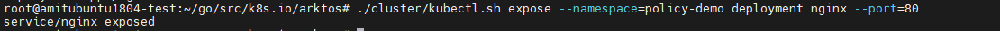
 
#### 3. Ensure the nginx service is accessible.
#### Command
```bash
./cluster/kubectl.sh run --namespace=policy-demo access --rm -ti --image busybox /bin/sh
```
### Arktos cluster tear-down
#### To terminate arktos cluster, run the following:
#### Command
```bash
sudo ./cluster/kube-down.sh
```
#### Output
 
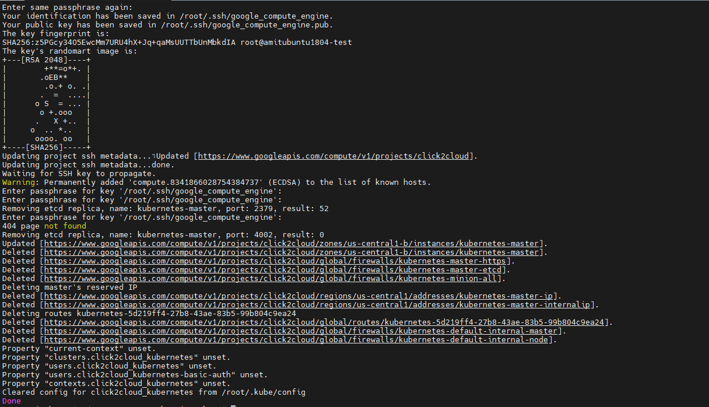
 
## End Result:
### Tested two network policy criterion.
# Passed

