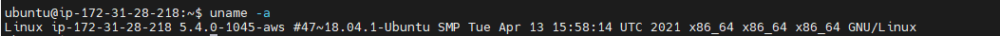
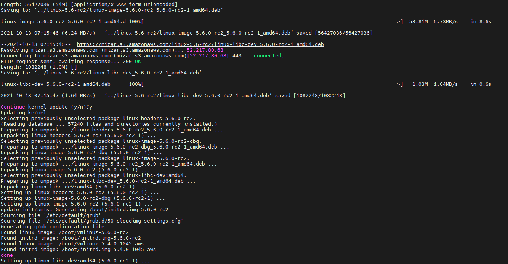
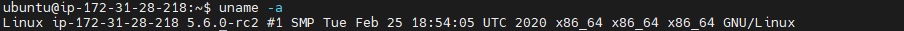
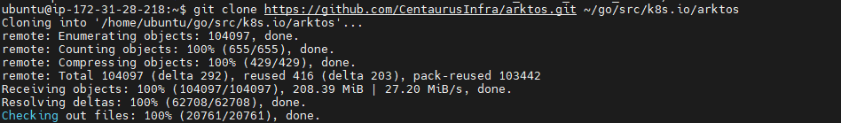
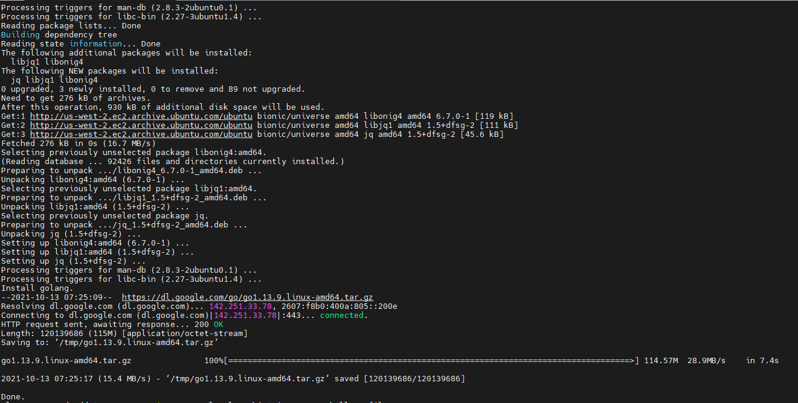
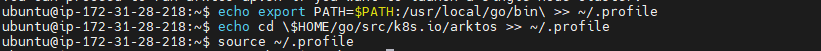
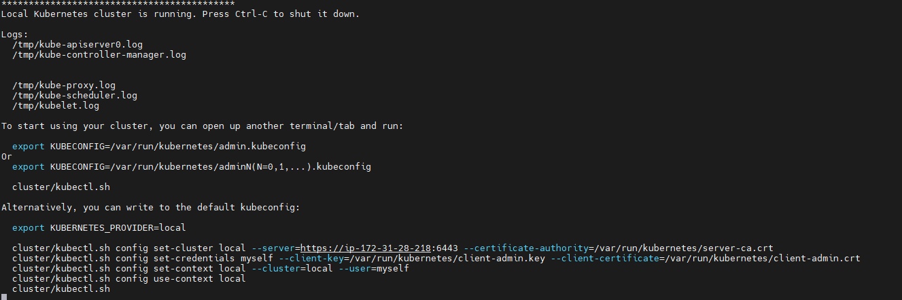
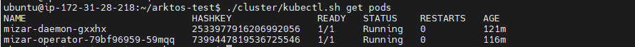

# Arktos deployment with Mizar CNI
### Prepare lab machine, the preferred OS is Ubuntu 18.04. If you are using AWS, the recommended instance size is t2.2xlarge and the storage size is 128GB or more.

### Step 1: Check the kernel version:
### Command:
```bash
uname -a
```
### Output:
 
 ### Update the kernel if the kernel version is below 5.6.0-rc2

 ### Command:
```bash
wget https://raw.githubusercontent.com/CentaurusInfra/mizar/dev-next/kernelupdate.sh

sudo bash kernelupdate.sh
```
### Output:




### 2. Clone the Arktos repository and install the required dependencies:
### Command:
```bash
git clone https://github.com/CentaurusInfra/arktos.git ~/go/src/k8s.io/arktos

sudo bash $HOME/go/src/k8s.io/arktos/hack/setup-dev-node.sh

echo export PATH=$PATH:/usr/local/go/bin\ >> ~/.profile

echo cd \$HOME/go/src/k8s.io/arktos >> ~/.profile

source ~/.profile
```
### Output:






### 3. Start Arktos cluster
### Command:
```bash
CNIPLUGIN=mizar ./hack/arktos-up.sh
```
### Output:




### Pods were in running state from last 121 min.
## No error occured.


