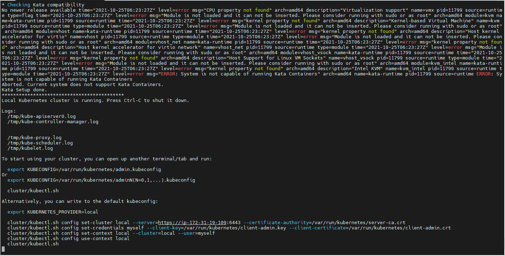
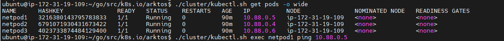

## Scenario 1:
# Arktos deployment without Mizar CNI

## Prepare lab machine
### The preferred OS is Ubuntu 18.04.
### For AWS, the recommended instance size is t2.2xlarge and the storage size is 128GB or more.

## Steps:

### 1. Check the kernel version:
### Command:
```bash
uname -a
```
### Output:


#### Update the kernel if the kernel version is below 5.6.0-rc2.

### Command:
```bash
wget https://raw.githubusercontent.com/CentaurusInfra/mizar/dev-next/kernelupdate.sh

sudo bash kernelupdate.sh
```
### Output:


#### Recheck Kernel version
### Command:
```bash
uname -a
```
### Output:


### 2. Clone the Arktos repository and install the required dependencies:

### Command:
```bash
git clone https://github.com/Click2cloud-Centaurus/arktos.git ~/go/src/k8s.io/arktos -b default-cni-mizar

cd ~/go/src/k8s.io/arktos

git checkout default-cni-mizar

sudo bash ./hack/setup-dev-node.sh
```
### Output:


### Command:
```bash
echo export PATH=$PATH:/usr/local/go/bin\ >> ~/.profile

echo cd \$HOME/go/src/k8s.io/arktos >> ~/.profile

source ~/.profile
```

### Output:


### 3. Start Arktos cluster without CNI Mizar

### Command:
```bash
./hack/arktos-up.sh
```
### Output:
Error on first execution


Arktos got up after second execution


### Check Nodes:

### Command:
```bash
./cluster/kubectl.sh get nodes
```
### Output:


### Deploy net pods through yaml file

### Command:
```bash
vi netpod.yaml

./cluster/kubectl.sh apply -f netpod.yaml

```
### Output:


### Check deployed pods
### Command:
```bash
./cluster/kubectl.sh get pods
```

### Output:


### Check Ping for the deployed pods

### Command:
```bash
./cluster/kubectl.sh get pods -o wide

./cluster/kubectl.sh exec [Pod name] ping [ip]
```
### Output:



## Pass

## Scenario 2:
# Arktos deployment with Mizar CNI

### 1. Check Kernal version
### Command:
```bash
uname -a
```
### Output:


### 2. Clone the Arktos repository and install the required dependencies:

### Command:
```bash
git clone https://github.com/Click2cloud-Centaurus/arktos.git ~/go/src/k8s.io/arktos -b default-cni-mizar

cd ~/go/src/k8s.io/arktos

git checkout default-cni-mizar

sudo bash ./hack/setup-dev-node.sh
```
### Output:


### Command:
```bash
echo export PATH=$PATH:/usr/local/go/bin\ >> ~/.profile
echo cd \$HOME/go/src/k8s.io/arktos >> ~/.profile
source ~/.profile
```
### Output:


### 3. Start Arktos cluster
### Command:
```bash
CNIPLUGIN=mizar ./hack/arktos-up.sh
```
### Output:


### Check nodes
### Command:
```bash
./cluster/kubectl.sh get nodes
```
### Output:


### Check Mizar Pods
### Command:
```bash
./cluster/kubectl.sh get pods
```

### Output:


### Deploy net pods

### Command:
```bash
./cluster/kubectl.sh apply -f netpod.yaml
```
### Output:


### Check deployed pods
### Command:
```bash
./cluster/kubectl.sh get pods
```
### Output:

 ### Deployed pods got stuck in container creation state

 ### Check VPCs
 ### Command:
 ```bash
 ./cluster/kubectl.sh get vpcs
 ```
 ### Output:
 

 ### Check Subnets:
 ### Command:
 ```bash
 ./cluster/kubectl.sh get subnets
 ```
### Output:


## Pass

### Scenario 3:
# Arktos deployment without Mizar CNI after deployment with Mizar CNI.

### 1. Check Kernal version
### Command:
```bash
uname -a
```
### Output:


### 2. Clone the Arktos repository and install the required dependencies:
### Command:
```bash 
git clone https://github.com/Click2cloud-Centaurus/arktos.git ~/go/src/k8s.io/arktos -b default-cni-mizar

cd ~/go/src/k8s.io/arktos

git checkout default-cni-mizar

sudo bash ./hack/setup-dev-node.sh
```
### Output:


### Command:
```bash
echo export PATH=$PATH:/usr/local/go/bin\ >> ~/.profile
echo cd \$HOME/go/src/k8s.io/arktos >> ~/.profile
source ~/.profile
```
### Output:


### 3. Start Arktos cluster
### Command:
```bash
 ./hack/arktos-up.sh
```
### Output:


### Check Nodes
### Command:
```bash
./cluster/kubectl.sh get nodes
```
### Output:


### Deploy net pods

### Command:
```bash
./cluster/kubectl.sh apply -f netpod.yaml
```
### Output:


### Check Deployed pods
### Command:
```bash
./cluster/kubectl.sh get pods
```
### Output:


### Deployed pods got stuck in Container creation state.

## Fail


