# grpcio-patch test
## Prepare lab machine 1
#### The preferred OS is Ubuntu 18.04.
#### If you are using AWS, the recommended instance size is t2.2xlarge and the storage size is 128GB or more

### 1. Check the kernel version:
### Command:
```bash
uname -a
```
### Output:
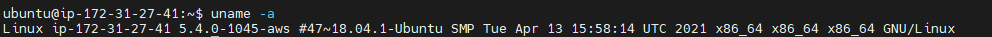

#### Update the kernel if the kernel version is below 5.6.0-rc2

### Command:
```bash
wget https://raw.githubusercontent.com/CentaurusInfra/mizar/dev-next/kernelupdate.sh

sudo bash kernelupdate.sh
```
### Output:
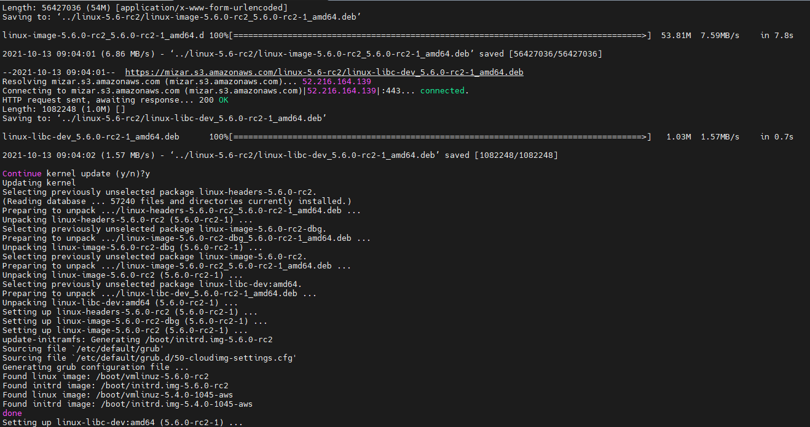

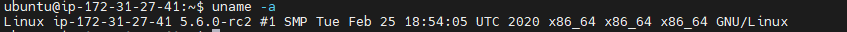

#### Clone the Arktos repository and install the required dependencies:
### Command:
```bash
git clone https://github.com/CentaurusInfra/arktos.git ~/go/src/k8s.io/arktos.git 

sudo bash $HOME/go/src/k8s.io/arktos/hack/setup-dev-node.sh
```
### Output:
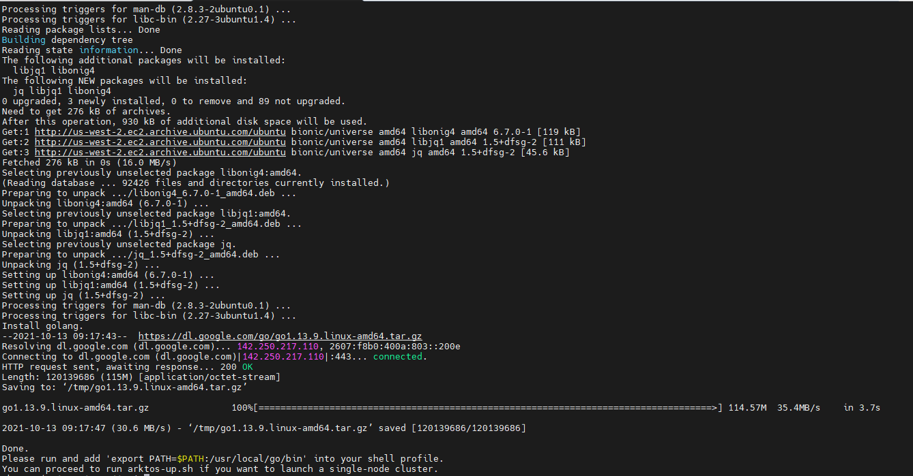

### Command
```bash
echo export PATH=$PATH:/usr/local/go/bin\ >> ~/.profile
echo cd \$HOME/go/src/k8s.io/arktos >> ~/.profile
source ~/.profile
```
### Output:
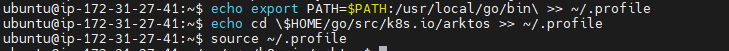

### 3. Start Arktos cluster
### Command:
```bash
./hack/arktos-up.sh
```
### Output:
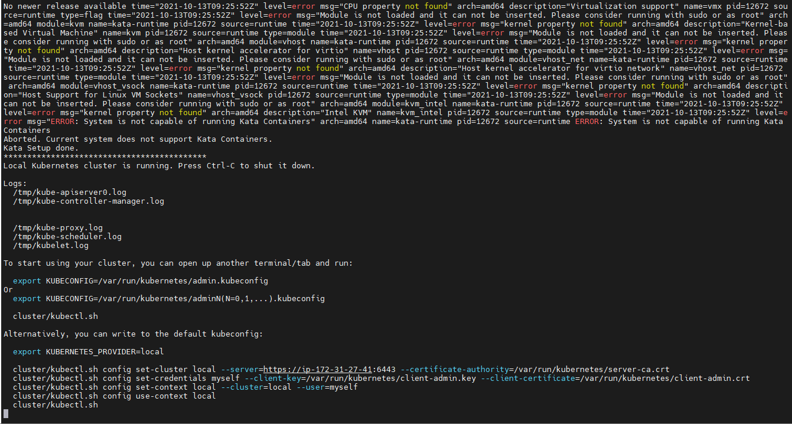

### Verify mizar pods i.e. mizar-operator and mizar-daemon pods are in running state, for that run:

### Command:
```bash
./cluster/kubectl.sh create -f https://raw.githubusercontent.com/CentaurusInfra/mizar/dev-next/etc/deploy/deploy.mizar.yaml
```
### Output:
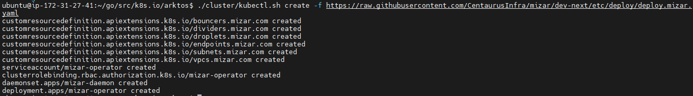

### Check Pods

### Command:
```bash
./cluster/kubectl.sh.get pod
```
### Output
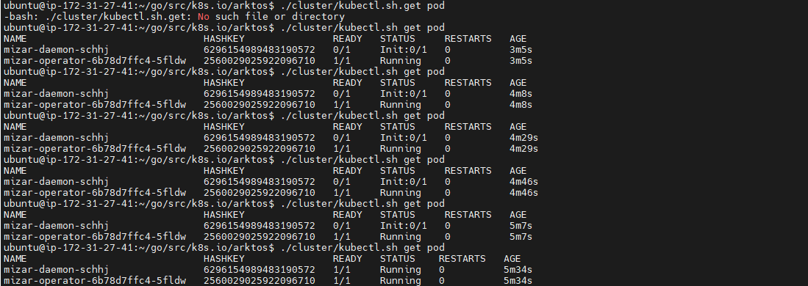

### Time taken by mizar-daemon pod to come in running state was 5 min 30 Sec.

### Time taken by mizar-operator pod to come in running state was 40 sec.


## Prepare lab machine 2

### The preferred OS is Ubuntu 18.04.
### If you are using AWS, the recommended instance size is t2.2xlarge and the storage size is 128GB or more

### Step1: Check the kernel version:
### Command:
```bash
uname -a
```
### Output:
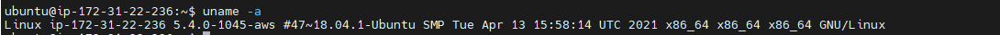

#### Update the kernel if the kernel version is below 5.6.0-rc2

### Command:
```bash
wget https://raw.githubusercontent.com/CentaurusInfra/mizar/dev-next/kernelupdate.sh

sudo bash kernelupdate.sh
```
### Output:
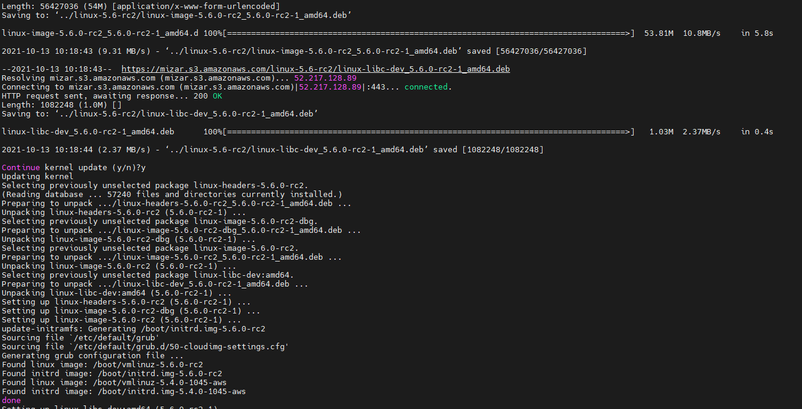

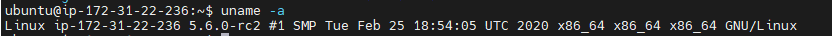


#### Clone the Arktos repository and install the required dependencies:
### Command:
```bash
git clone https://github.com/CentaurusInfra/arktos.git ~/go/src/k8s.io/arktos.git 

sudo bash $HOME/go/src/k8s.io/arktos/hack/setup-dev-node.sh
```
### Output:
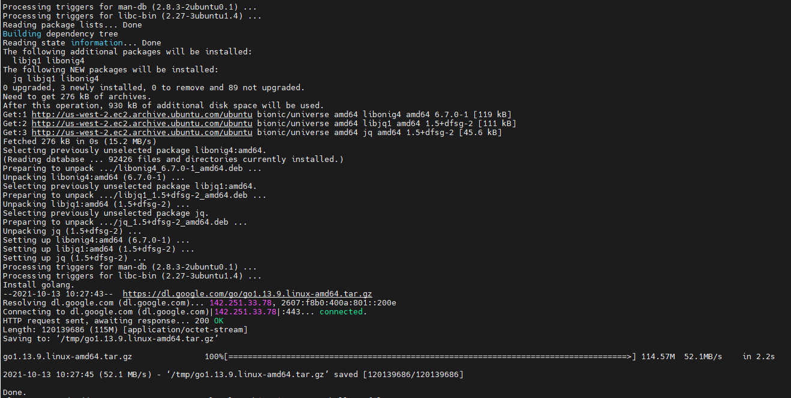

### Command
```bash
echo export PATH=$PATH:/usr/local/go/bin\ >> ~/.profile
echo cd \$HOME/go/src/k8s.io/arktos >> ~/.profile
source ~/.profile
```
### Output:
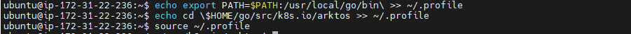

### 3. Start Arktos cluster
### Command:
```bash
./hack/arktos-up.sh
```
### Output:
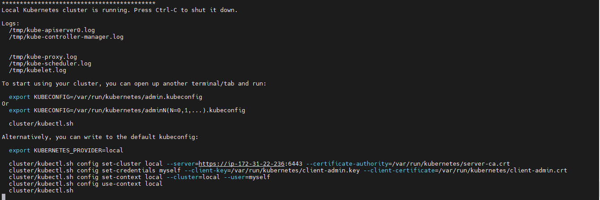

### Verify mizar pods i.e. mizar-operator and mizar-daemon pods are in running state, for that run:
### Command:
```bash
./cluster/kubectl.sh create -f https://raw.githubusercontent.com/Click2Cloud-Centaurus/mizar/grpcio-fix/etc/deploy/deploy.mizar.yaml
```
### Output:
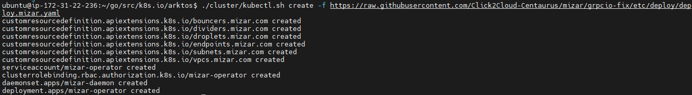

### Check Pods

### Command:
```bash
./cluster/kubectl.sh.get pod
```
### Output
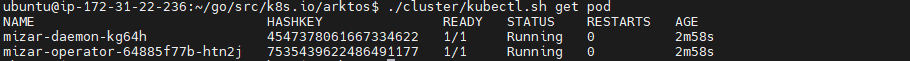

### Time taken by mizar-daemon pod to come in running state was 2 min 30 Sec.

### Time taken by mizar-operator pod to come in running state was 2 min 30 sec.


